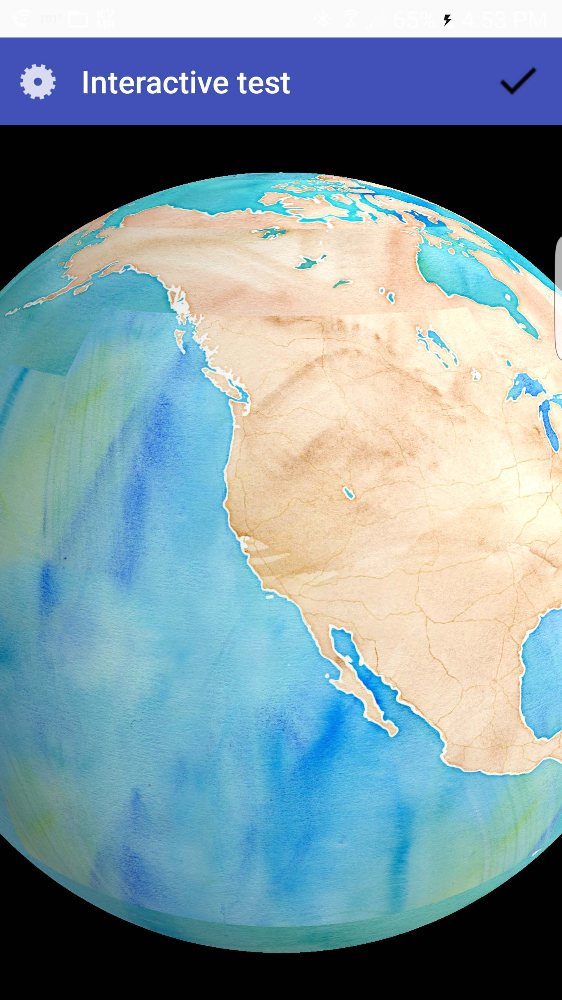
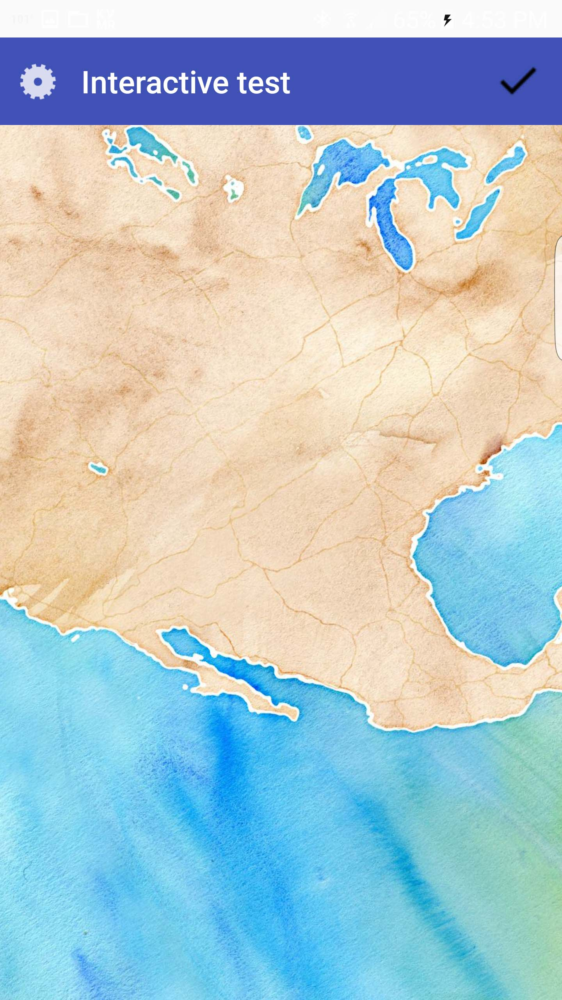

*Tutorial by Nicholas Hallahan.*

AutoTesterAndroid is the [example app](https://github.com/mousebird/WhirlyGlobe/tree/develop_3_0/WhirlyGlobeSrc/AutoTesterAndroid) that demonstrates and tests many WhirlyGlobe-Maply features. This app uses both the Whirly Globe globe and Maply map.

```sh
cd WhirlyGlobeSrc/AutoTesterAndroid
```

There is a script that will compile and build the project for you. This script compiles an AAR and moves it to the correct directory in the AutoTesterAndroid project. It is for your convenience.

```sh
./buildmaply.sh
```

Upon success, you should see:

```
BUILD SUCCESSFUL

Total time: 5 mins 53.322 secs
```

Now, open Android Studio and select __Import project__.


Browse to the root of the `AutoTesterAndroid` project, which is located in:

```
WhirlyGlobe/WhirlyGlobeSrc/AutoTesterAndroid
```

That's it! You should be able to build the project normally in Android Studio.

| WhirlyGlobe Component | Maply Component |
| -- | -- |
|  | |