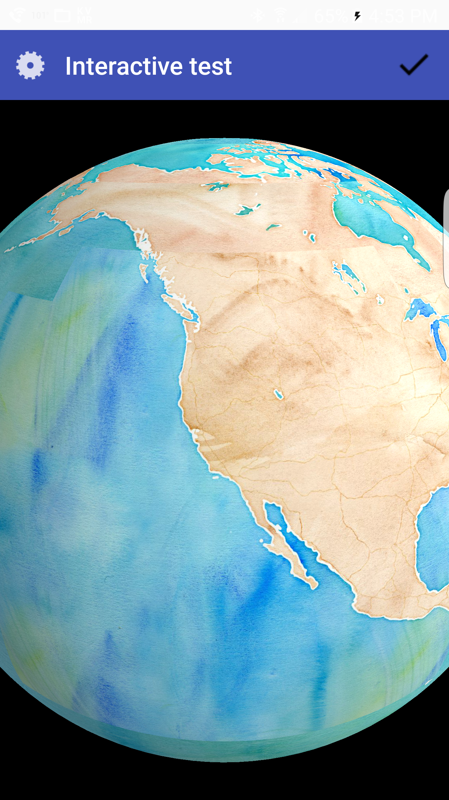

AutoTesterAndroid is the [example app](https://github.com/mousebird/WhirlyGlobe/tree/develop_3_0/WhirlyGlobeSrc/AutoTesterAndroid) that demonstrates many WhirlyGlobe-Maply features. This app uses both the Whirly Globe globe component and Maply map component.

```sh
cd WhirlyGlobeSrc/AutoTesterAndroid
```

There is a script that will compile and build the project for you.

```sh
./buildmaply.sh
```

Upon success, you should see:

```
BUILD SUCCESSFUL

Total time: 5 mins 53.322 secs
```

Now, open Android Studio and select __Import project__.


Browse to the root of the `AutoTesterAndroid` project, which is located in:

```
WhirlyGlobe/WhirlyGlobeSrc/AutoTesterAndroid
```

| WhirlyGlobe Component | Maply Component |
| -- | -- |
|  | |