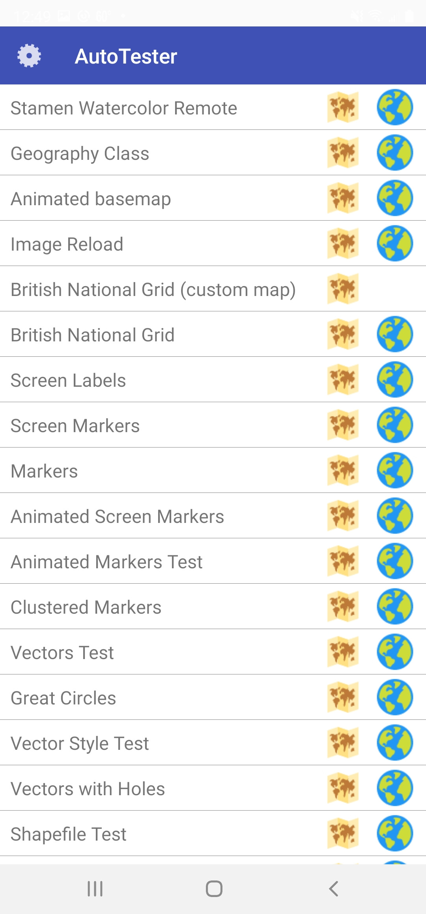

[AutoTesterAndroid](https://github.com/mousebird/WhirlyGlobe/tree/master/WhirlyGlobeSrc/android/apps/AutoTesterAndroid) is an example application which demonstrates and tests many WhirlyGlobe-Maply features. This app uses both the Whirly Globe globe and Maply map.

First, you'll need to clone the [WhirlyGlobe-Maply Repository](https://github.com/mousebird/WhirlyGlobe).


git clone https://github.com/mousebird/WhirlyGlobe.git


Them, in Android Studio, select the __File__ / __Open__ command, navigate to and select the `android/apps/AutoTesterAndroid` directory to open the project.

Once open, you should be able to use the __Run 'app'__ command to start AutoTesterAndroid on the selected device or simulator.

---

*Tutorial by Nicholas Hallahan, Steve Gifford, Tim Sylvester.*

