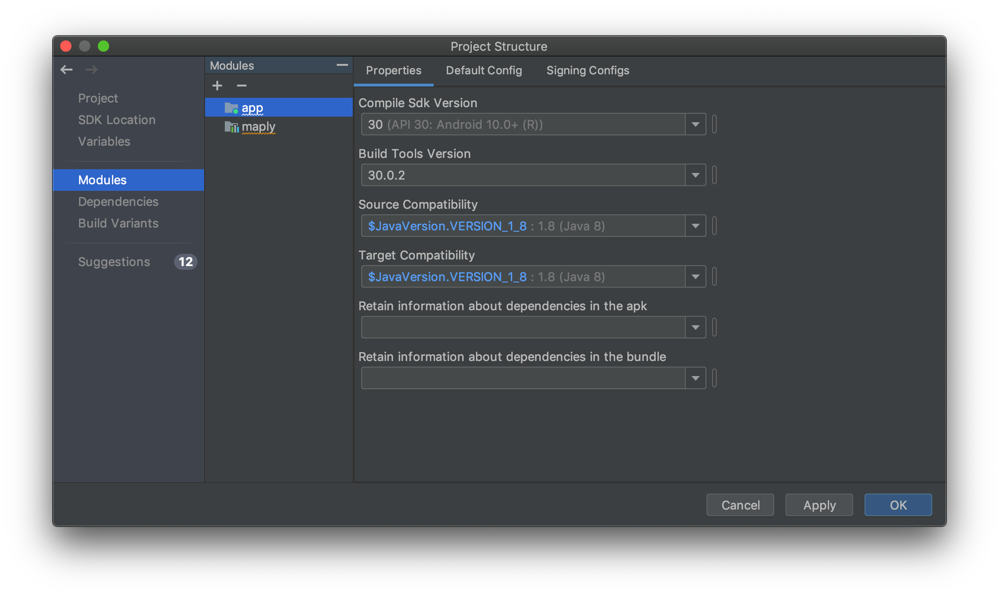

The simplest way to start using WhirlyGlobe-Maply is the pre-built binary.  Take a look at the [builds page](/WhirlyGlobe/builds/builds.html) page.  From there you can get the AAR file, and we'll show you how to use it here.

### Copy and Include AAR

Copy your just-downloaded `.aar` file into your app's `libs` directory:

```
HelloEarth/app/libs
```

Rename it to `WhirlyGlobeMaply.aar`.

Add the following `flatDir` directive to the `build.gradle (Project: HelloEarth)` file inside of the `allprojects > repositories` directive.

```gradle
allprojects {
    repositories {
        jcenter()
        flatDir {
            dirs 'libs'
        }
    }
}
```


Next add the following packages to the end of the `dependencies` directive in `build.gradle (Module: app)`.

* `implementation 'com.squareup.okhttp3:okhttp:3.14.2'`
* `implementation(name:'WhirlyGlobeMaply', ext:'aar')`


```gradle
dependencies {
    implementation fileTree(dir: "libs", include: ["*.jar"])
    implementation 'androidx.appcompat:appcompat:1.2.0'
    implementation 'androidx.constraintlayout:constraintlayout:2.0.1'
    testImplementation 'junit:junit:4.12'
    androidTestImplementation 'androidx.test.ext:junit:1.1.2'
    androidTestImplementation 'androidx.test.espresso:espresso-core:3.3.0'
    implementation 'com.squareup.okhttp3:okhttp:3.14.2'
    implementation(name:'WhirlyGlobeMaply', ext:'aar')
}
```

Android Studio will ask you to sync Gradle. If all goes well, it will sync without complaint.


### Set Version Compatibility

In order to avoid errors and conflicts, set the source and target compatibility options for the new application to match those of the maply module in the `File` / `Project Structure` options dialog.



In particular, this has been observed to cause the following exception on application start:

`java.lang.NoSuchMethodError: No static method metafactory(...); in class ...LambdaMetafactory; or its super classes ...`

### Example App

To continue building HelloEarth, go to the [Your First Globe or Map](your-first-globe-or-map.html) page.

Besides the [Hello Earth](hello-earth.html) project, there is an example app you can try out called `AutoTesterAndroid`. This is optional, but it is the quickest way to _see something work_. We have [brief instructions](auto-tester-android.html) for you to build AutoTesterAndroid.

---

*Tutorial by Nicholas Hallahan, Steve Gifford, Tim Sylvester.*

