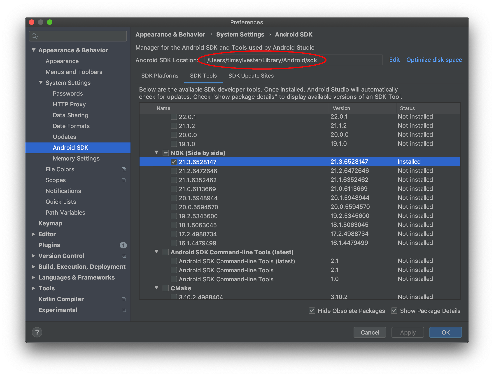

Currently the only way to include WhirlyGlobe-Maply into you Android project is by compiling the source code. We are working on Maven builds that can be simply included in your gradle file, but for now, you need to build from source.

The advantage of building from source is that you can modify and customize WhirlyGlobe-Maply, and your changes will immediately be compiled into your project. If you plan on modifying this toolkit, building from source is your best option.

### Clone Git Repository

First you will want to clone the toolkit from Github.

```sh
git clone https://github.com/mousebird/WhirlyGlobe.git
```

The Android portion of the SDK is in the `develop_3_0` branch. Check out this branch.

```sh
cd WhirlyGlobe
git checkout develop_3_0
```

WhirlyGlobe-Maply uses a bunch of submodules for its dependencies.

```sh
git submodule init
git submodule update
```

There are 13 git submodules that need to be cloned and initialized. This usually takes about a minute.

### local.properties

Our build scripts need to know the location of your Android SDK and Android NDK. This is done by creating a `local.properties` file in the `WhirlyGlobe/WhirlyGlobeSrc/Android/` directory. My `local.properties` file is below. Replace these paths to the paths of your Android SDK and NDK respectively.

```
sdk.dir=/Users/njh/Library/Android/sdk
ndk.dir=/usr/local/Cellar/android-ndk/r10e
```

Homebrew usually places packages in `/usr/local/Cellar`. This is a good place to look to find your NDK. You can find the location of your Android SDK your Android Studio Preferences (Android Studio > Preferences):



### Building an AAR

The `.aar` is the binary package container format Android uses, an extension to Java's `.jar` container. Through gradle, we create an AAR of WhirlyGlobe-Maply that you can copy over to your Hello Earth project. First, make sure you are in the Android directory:

```
WhirlyGlobe/WhirlyGlobeSrc/Android
```

Then, execute the `gradlew` build script:

```
./gradlew assemble
```

This will take several minutes. You will be compiling the entierty of WhirlyGlobe-Maply into an AAR file. In fact, there will be two AAR files--one in Debug mode and the other in Release mode.

These AAR files will be located in:

```
WhirlyGlobe/WhirlyGlobeSrc/Android/build/outputs/aar
```

Unless you need to debug the underlying library, you should use the `Android-release.aar` in your Hello Earth project. Keep track of this file, you will need to copy it into your app's project.

### Example App

Before starting your own "[Hello Earth](hello-earth.html)" project, there is an example app you can try out called `AutoTesterAndroid`. This is optional, but it is the quickest way to _see something work_. We have [brief instructions](auto-tester-android.html) for you to build AutoTesterAndroid.


