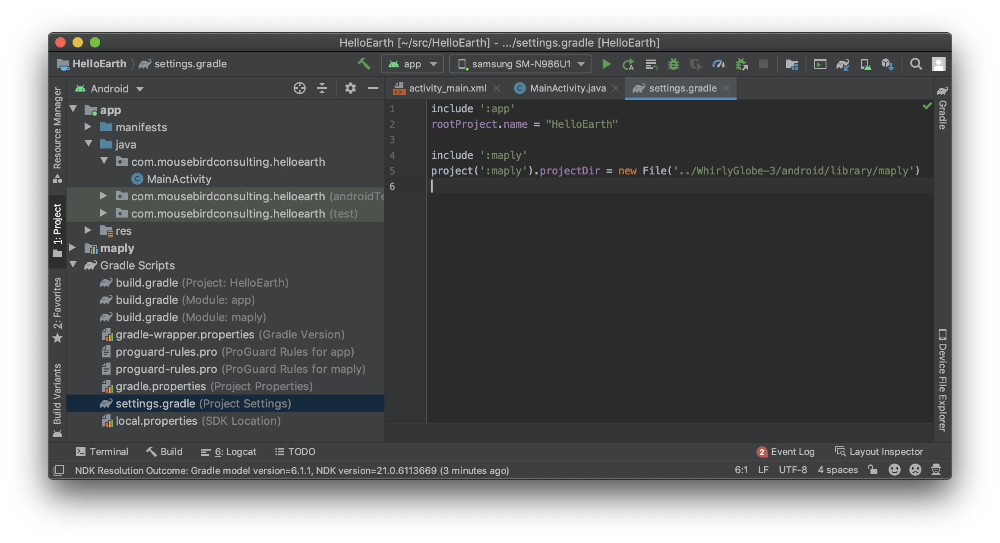
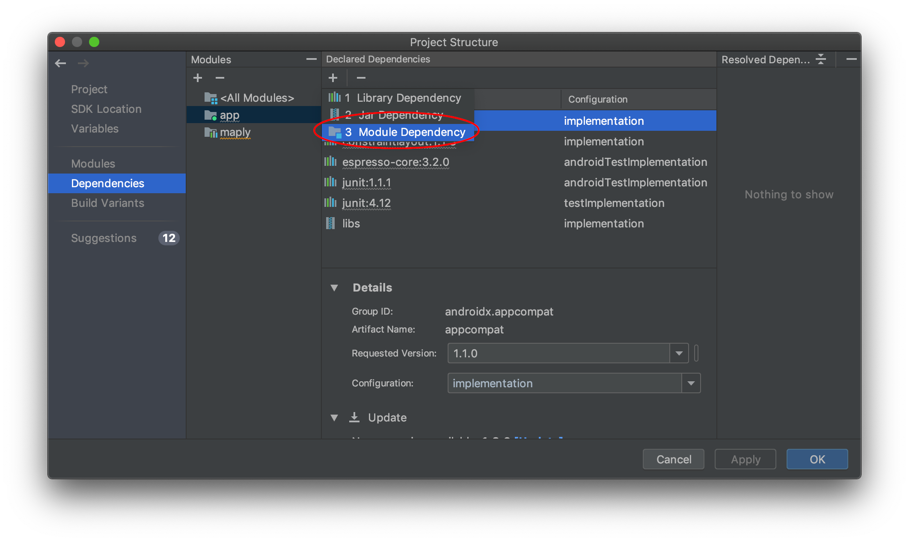
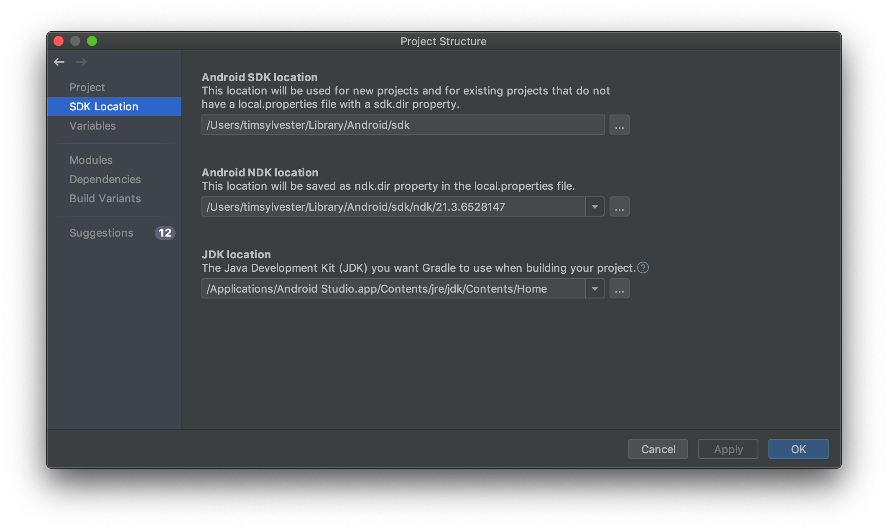

Building the toolkit from source, you'll be able to modify and customize WhirlyGlobe-Maply, and your changes will immediately be compiled into your project. If you plan on modifying this toolkit, building from source is your best option.

### Clone Git Repository

First you will want to clone the toolkit from Github, if you have not already done so.

```sh
git clone https://github.com/mousebird/WhirlyGlobe.git
```

The Android portion of the SDK is in the `develop` branch. Check out this branch.

```sh
cd WhirlyGlobe
git checkout develop
```

WhirlyGlobe-Maply uses submodules for its dependencies, so you will need to initialize them as well.

If you're using a GUI for Git, select the "recursive" option when cloning and it should take care of this.

```sh
git submodule init
git submodule update
```

### Maply Module Reference

Open `settings.gradle (Project Settings)` and add the following lines, updating the relative path into the WhirlyGlobe repository, if necessary:

```
include ':maply'
project(':maply').projectDir = new File('../WhirlyGlobe-3/android/library/maply')
```



Next, open `File`/`Project Structure`, select `Dependencies`, select the `app` module, click the `Add Dependency` (`+`) button, and select `Module Dependency`.



In the resulting dialog, check the box next to `maply` and accept.


From this point, Android Studio should build maply and use it whenever necessary while building `HelloEarth`.

### Android SDK and NDK

The build scripts need to know the location of the Android SDK and Android NDK.  Android Studio should take care of installing and/or locating an SDK directory for you, and should prompt you to install the appropriate NDK based on the version referenced by the Maply project.


If you need to adjust these settings, open Android Studio Preferences, select `Appearance and Behavior`, then `System Settings`, then `Android SDK`.  Here you will be able to select the SDK location, which should be handled automatically, and related packages.  The NDK can be found under `SDK Tools`, and individual NDK versions are available when the `Show Package Details` option is checked.


Once the appropriate SDK and NDK are available, open `File` / `Project Structure`, then select `SDK Location` and ensure that the paths are set correctly.



### Set Version Compatibility

In order to avoid errors and conflicts, set the source and target compatibility options for the new application to match those of the maply module in the `File` / `Project Structure` options dialog.

### Example App

Besides this "[Hello Earth](hello-earth.html)" project, there is an example app you can try out called `AutoTesterAndroid`. This is optional, but it is the quickest way to _see something work_. We have [brief instructions](auto-tester-android.html) for you to build AutoTesterAndroid.

---

*Tutorial by Nicholas Hallahan, Steve Gifford, Tim Sylvester.*

