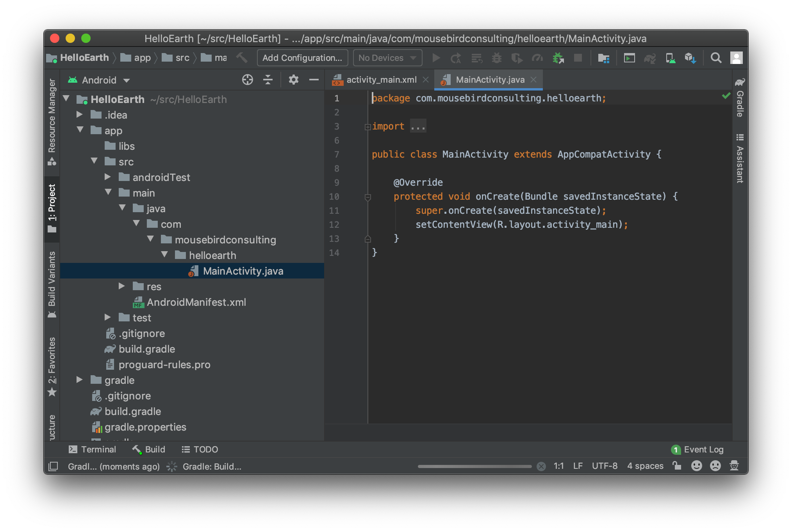

Now we will be building a _Hello Earth_ project. Similar to your typical _Hello World_, we will be creating a basic project in Android Studio that displays a globe and map using WhirlyGlobe-Maply.

_Note: You can check out the [completed Android tutorial](https://github.com/mousebird/AndroidTutorialProject) on Github. It includes the WhirlyGlobe-Maply library and everything you need--all you have to do is run it in Android Studio._

### Start New Android Studio Project

Open Android Studio and select _Start a new Android Studio project_.

_Hello Earth_ is a very basic app that is meant to get you started. Select an _Empty Activity_ -- no bells and whistles.

Name your application `HelloEarth`. Put this application somewhere outside of the WhirlyGlobe git repo.

We're selecting the Minimum SDK to be `API 28: Android 9.0 (Pie)`.   WhirlyGlobe-Maply can go back much farther, so pick what you need.

Select __Finish__.  You should see something similar to this.

### WhirlyGlobe-Maply Distributions

At this point, you have started a new standard project, but you need to add WhirlyGlobe-Maply library as a dependency. 

We distribute the WhirlyGlobe-Maply library for Android in a couple of ways ways. Either of them is fine.  Pick the one you are most familiar with.  Don’t care?  Try the binary.

* [Building from Source](building-from-source.html) - Use the source the code to build your own binary.
* [Building from Binary](building-from-binary.html) - Use the pre-built binaries.

It’s like a pick your own adventure book, but boring.  So just like a pick your own adventure book.

---

*Tutorial by Nicholas Hallahan, Steve Gifford, Tim Sylvester.*
