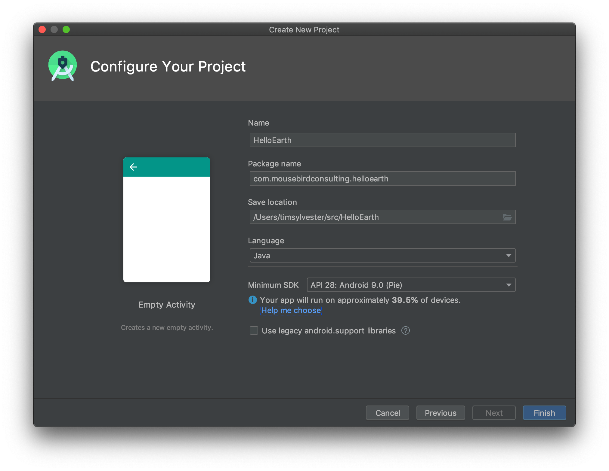
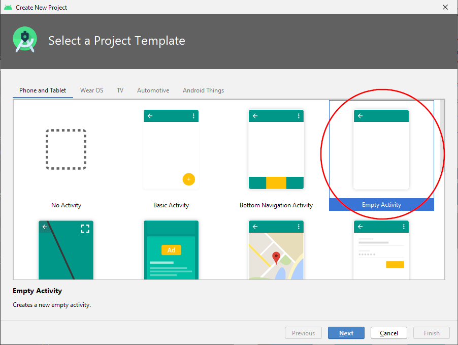
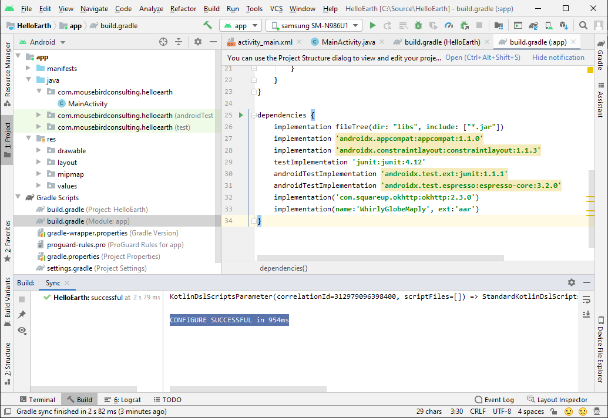
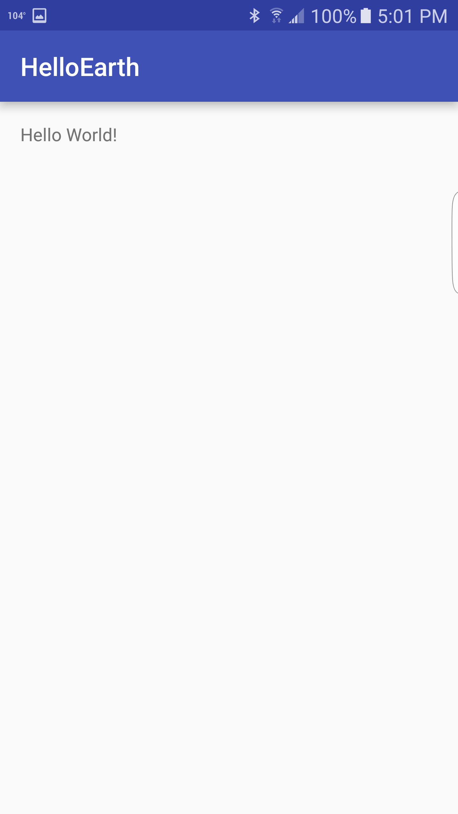

Now we will be building a _Hello Earth_ project. Similar to your typical _Hello World_, we will be creating a basic project in Android Studio that displays a globe and map using WhirlyGlobe-Maply.

### Start New Android Studio Project

Open Android Studio and select _Start a new Android Studio project_.


Name your application `HelloEarth`. Put this application somewhere outside of the WhirlyGlobe git repo.



We're selecting the Minimum SDK to be `API 17: Android 4.2 (Jelly Bean)`. This is the most typical minimum for a project these days. WhirlyGlobe-Maply, however, does support Android SDKs as low as `API 14: Android 4.0 (Ice Cream Sandwich)`.


_Hello Earth_ is a very basic app that is meant to get you started. Select an _Empty Activity_ -- no bells and whistles.



We're going to just have one activity in this app, so keep the default name as `MainActivity`.


Select __Finish__.

### Copy and Include AAR

Earlier you built the WhirlyGlobe-Maply library from source. We are including that compiled `.aar` of the library in our _HelloEarth_ project.

Copy your `Android-release.aar` that you built into your app's `libs` directory.

```
WhirlyGlobe/WhirlyGlobeSrc/HelloEarth/app/libs
```

Rename it to `WhirlyGlobeMaply.aar`.

Add the following `flatDir` directive to your `Build.gradle (Project: HelloEarth)` file inside of the `allprojects > repositories` directive.

```gradle
allprojects {
    repositories {
        jcenter()
        flatDir {
            dirs 'libs'
        }
    }
}
```


Next add the following packages to the end of the `dependencies` directive in `Build.gradle (Module: app)`.

* `compile 'com.squareup.okhttp:okhttp:2.3.0'`
* `compile(name:'WhirlyGlobeMaply', ext:'aar')`

```gradle
dependencies {
    compile fileTree(dir: 'libs', include: ['*.jar'])
    testCompile 'junit:junit:4.12'
    compile 'com.android.support:appcompat-v7:24.0.0'
    compile 'com.android.support:support-v4:24.0.0'
    compile 'com.squareup.okhttp:okhttp:2.3.0'
    compile(name: 'WhirlyGlobeMaply', ext: 'aar')
}
```

Android Studio will ask you to sync Gradle. If all goes well, it will sync without complaint.



At this point, you have started a new project and setup the WhirlyGlobe-Maply library as a Gradle dependency. You are now ready to setup your fragments and see a map!

Go ahead and build your project. You should see a boilerplate __Hello World!__ text view in a basic activity.



