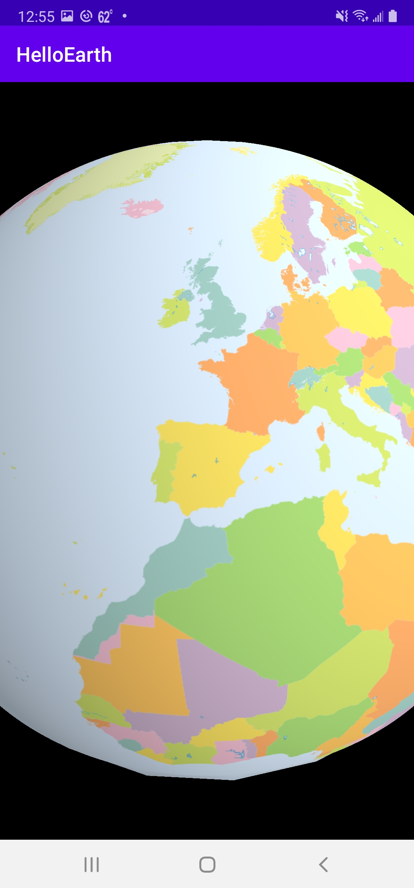

*Tutorial by Nicholas Hallahan.*

Now we're going to add a local image layer to your map. You can have map image tiles stored on your device using the SQLite based MBTiles format. We're going to show you how to load an MBTiles file from your device and display these tiles.

### Copy Geography Class MBTiles to Device

For the sake of keeping this tutorial simple, we're going to manually copy an MBTiles file to your Android device's `ExternalStorage`. For a production app, you'll want to [explore various means](https://github.com/mousebird/WhirlyGlobe/blob/e9dec4068156191861d40d5dded1c079449c26f2/WhirlyGlobeSrc/AutoTesterAndroid/app/src/main/java/com/mousebirdconsulting/autotester/TestCases/MBTilesImageTestCase.java#L138-L162) of getting an MBTiles file onto the device automatically, but that is out of scope from this basic tutorial.

First, download our sample [Geography Class MBTiles file](http://whirlyglobedocs.s3-website-us-east-1.amazonaws.com/tutorialsupport/geography-class_medres.mbtiles) to your computer. Then, using [Android File Transfer](https://www.android.com/filetransfer/), create an `mbtiles` directory in the `Phone` tab of the file explorer.


Drag over your `geography-class_medres.mbtiles` file into your `mbtiles` directory.

### Granting Permission

You can add an MBTiles file from the internal storage of you app, however, in this tutorial, we added it to `ExternalStorage`. We need to grant the app permission to access `ExternalStorage`, and we must also explicity ask the user for permission.

In your [AndroidManifest.xml](https://github.com/mousebird/AndroidTutorialProject/blob/cb8f82ed651cbd8b61524febc9321ec5045e10fd/app/src/main/AndroidManifest.xml#L5), add the following line to your manifest:

```xml
<uses-permission android:name="android.permission.WRITE_EXTERNAL_STORAGE" />
```

Your manifest should now look like the following:

```xml
<?xml version="1.0" encoding="utf-8"?>
<manifest xmlns:android="http://schemas.android.com/apk/res/android"
    package="io.theoutpost.helloearth">

    <uses-permission android:name="android.permission.WRITE_EXTERNAL_STORAGE" />

    <application
        android:allowBackup="true"
        android:icon="@mipmap/ic_launcher"
        android:label="@string/app_name"
        android:supportsRtl="true"
        android:theme="@style/AppTheme">
        <activity android:name=".MainActivity">
            <intent-filter>
                <action android:name="android.intent.action.MAIN" />

                <category android:name="android.intent.category.LAUNCHER" />
            </intent-filter>
        </activity>
    </application>

</manifest>
```

Also, you will need to prompt the user for permission to access files on the device. Let's do this in your [HelloMapFragment.java](https://github.com/mousebird/AndroidTutorialProject/blob/cb8f82ed651cbd8b61524febc9321ec5045e10fd/app/src/main/java/io/theoutpost/helloearth/HelloMapFragment.java#L44-L59).

```java
protected void controlHasStarted() {
    Activity activity = getActivity();
    final int REQUEST_EXTERNAL_STORAGE = 1;
    String[] PERMISSIONS_STORAGE = {
            Manifest.permission.READ_EXTERNAL_STORAGE,
            Manifest.permission.WRITE_EXTERNAL_STORAGE
    };
    int permission = ActivityCompat.checkSelfPermission(activity, Manifest.permission.WRITE_EXTERNAL_STORAGE);

    if (permission != PackageManager.PERMISSION_GRANTED) {
        // We don't have permission so prompt the user
        ActivityCompat.requestPermissions(
                activity,
                PERMISSIONS_STORAGE,
                REQUEST_EXTERNAL_STORAGE
        );
    }
    ...
}
```

This is just some boilerplate code you need to do in newer SDKs when accessing files in external storage.

### Comment Out RemoteTileSource

Our previous tutorial had code that adds Stamen Watercolor as a remote tile source to the map. Let's comment out the [following code](https://github.com/mousebird/AndroidTutorialProject/blob/cb8f82ed651cbd8b61524febc9321ec5045e10fd/app/src/main/java/io/theoutpost/helloearth/HelloMapFragment.java#L79-L83) in HelloMapFragment.java.

```java
//        String cacheDirName = "stamen_watercolor";
//        File cacheDir = new File(getActivity().getCacheDir(), cacheDirName);
//        cacheDir.mkdir();
//        RemoteTileSource remoteTileSource = new RemoteTileSource(new RemoteTileInfo("http://tile.stamen.com/watercolor/", "png", 0, 18));
//        remoteTileSource.setCacheDir(cacheDir);
```

### Create MBTilesImageSource

In place of the `RemoteTileSource`, we want to create an `MBTilesImageSource`. We get the MBTiles file, check if it is valid, and then create the local image source.

```java
File storageDir = Environment.getExternalStorageDirectory();
File mbtilesDir = new File(storageDir, "mbtiles");
File mbtilesFile = new File(mbtilesDir, "geography-class_medres.mbtiles");
if (!mbtilesFile.exists()) {
    new AlertDialog.Builder(activity)
            .setTitle("Missing MBTiles")
            .setMessage("Could not find MBTiles file.")
            .setPositiveButton(android.R.string.yes, new DialogInterface.OnClickListener() {
                public void onClick(DialogInterface dialog, int which) {
                    // do nothing
                }
            }).show();
}
MBTiles mbtiles = new MBTiles(mbtilesFile);
MBTilesImageSource localTileSource = new MBTilesImageSource(mbtiles);
```

Put this [right before](https://github.com/mousebird/AndroidTutorialProject/blob/cb8f82ed651cbd8b61524febc9321ec5045e10fd/app/src/main/java/io/theoutpost/helloearth/HelloMapFragment.java#L61-L75) the commented out `RemoteTileSource` code.

### Add to Layer

Now, let's add the `MBTilesImageSource` to the `QuadImageTileLayer` in place of the `RemoteTileSource`.

```java
QuadImageTileLayer baseLayer = new QuadImageTileLayer(mapControl, coordSystem, localTileSource);
```

That's it! Now you can see a local tile source being drawn on your map.

