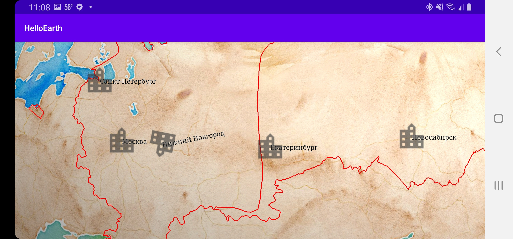

*Tutorial by Nicholas Hallahan.*

Adding screen lables is a very similar process to adding screen markers. Screen labels are 2D labels that follow a location on the globe or map. As the user moves, they move, but don’t get any bigger or smaller. You have a lot of control over how they look and interact, but they’re simple to use.

In our last tutorial we added some markers for the 5 largest cities in Russia. Since WhirlyGlobe-Maply supports UTF-8 strings, we're going to show off some cyrillic labels. We are going to add to our [HelloMapFragment.java](https://github.com/mousebird/AndroidTutorialProject/blob/432eed8fde466495694bf2d07cd4a2995a49f9fe/app/src/main/java/io/theoutpost/helloearth/HelloMapFragment.java#L119). Just comment out `insertMarkers();` in the `controlHasStarted` method and put in `insertLabels();` instead.

### Add Labels

Now, we are going to paste in what we going to declare our labels in a similar way that we did with our markers. Paste in the following method.

```java
private void insertLabels() {
        List<ScreenLabel> labels = new ArrayList<>();

        LabelInfo labelInfo = new LabelInfo();
        labelInfo.setFontSize(30f);
        labelInfo.setTextColor(Color.BLACK);
        labelInfo.setTypeface(Typeface.SERIF);
        labelInfo.setLayoutPlacement(LabelInfo.LayoutRight);
        labelInfo.setOutlineColor(Color.WHITE);
        labelInfo.setOutlineSize(1.f);

        float layoutImportance = 1.f;

        // Moskow - Москва
        ScreenLabel moskow = new ScreenLabel();
        moskow.loc = Point2d.FromDegrees(37.616667, 55.75); // Longitude, Latitude
        moskow.text = "Москва";
        moskow.layoutImportance = layoutImportance++;
        labels.add(moskow);

        //  Saint Petersburg - Санкт-Петербург
        ScreenLabel stPetersburg = new ScreenLabel();
        stPetersburg.loc = Point2d.FromDegrees(30.3, 59.95);
        stPetersburg.text = "Санкт-Петербург";
        stPetersburg.layoutImportance = layoutImportance++;
        labels.add(stPetersburg);

        // Novosibirsk - Новосибирск
        ScreenLabel novosibirsk = new ScreenLabel();
        novosibirsk.loc = Point2d.FromDegrees(82.95, 55.05);
        novosibirsk.text = "Новосибирск";
        novosibirsk.layoutImportance = layoutImportance++;
        labels.add(novosibirsk);

        // Yekaterinburg - Екатеринбург
        ScreenLabel yekaterinburg = new ScreenLabel();
        yekaterinburg.loc = Point2d.FromDegrees(60.583333, 56.833333);
        yekaterinburg.text = "Екатеринбург";
        yekaterinburg.layoutImportance = layoutImportance++;
        labels.add(yekaterinburg);

        // Nizhny Novgorod - Нижний Новгород
        ScreenLabel nizhnyNovgorod = new ScreenLabel();
        nizhnyNovgorod.loc = Point2d.FromDegrees(44.0075, 56.326944);
        nizhnyNovgorod.text = "Нижний Новгород";
        nizhnyNovgorod.layoutImportance = layoutImportance++;
        nizhnyNovgorod.rotation = Math.PI / 8;
        labels.add(nizhnyNovgorod);

        // Add your markers to the map controller.
        ComponentObject labelsComponentObject = mapControl.addScreenLabels(labels, labelInfo, MaplyBaseController.ThreadMode.ThreadAny);
    }
```

Notice there is a `LabelInfo` options object that defines how the text is going to look. `setLayoutPlacement` is an important `LabelInfo`property to set, because this determines the placement of the label in relation to the `loc` point. `LabelInfo.LayoutRight` means that the label is placed directly to the right of the `loc` point. Your other options are `LabelInfo.LayoutLeft` and `LabelInfo.LayoutCenter`.

Then, we create each label, set their properties, and add them to the map controller.



### Layout Engine

In addition to a location and text property for a `ScreenLabel`, we have a `layoutImportance`. Because labels often overlap or _collide_, we have a layout engine that helps us figure out which ones we want to draw. When two labels collide, the one that is rendered is the one with the higher `layoutImportance` floating point value. If you want all labels rendered regardless of collision, set the `layoutImportance` to `Float.MAX_VALUE`.

Lastly, we can rotate our screen labels in the same way that we did with screen markers. You will see that Нижний Новгород is slightly rotated counter-clockwise becaue we set a rotation of `Math.PI / 8`.
