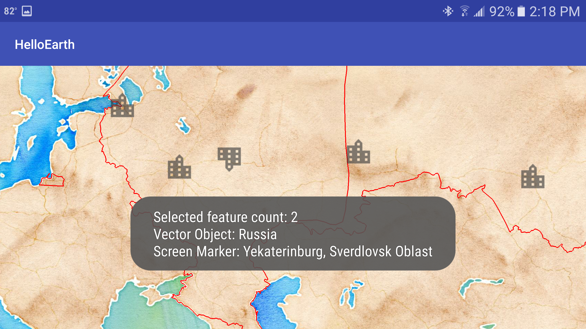
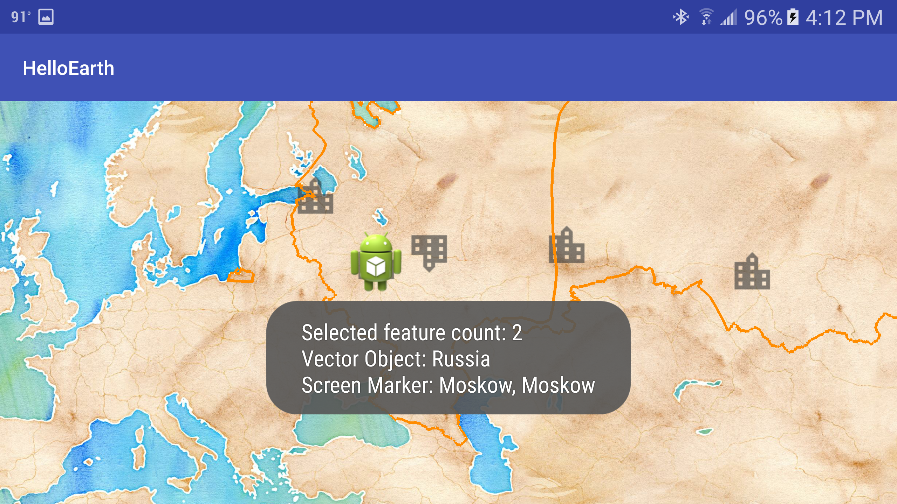

*Tutorial by Nicholas Hallahan.*

Screen marker selection is similar to [vector selection](vector-selection.html). Markers, however, are treated as an annotation to the map. Markers are added to the map to annotate a location with an icon, and this is done explicitly by creating a `ScreenMarker` object. Vector Objects, in contrast, are typically created by parsing vector formats like GeoJSON.

### Make Screen Marker Selectable

As with vector selection, we need to set the marker object to be selectable. In the [`insertMarkers`](https://github.com/mousebird/AndroidTutorialProject/blob/3318085f5192b6cf28a7294968a480006817804a/app/src/main/java/io/theoutpost/helloearth/HelloMapFragment.java#L160) method in HelloMapFragment.java, go through each `ScreenMarker` and make `moskow.selectable = true;`.

```java
private void insertMarkers() {
    ...
    // Moskow - Москва
    MarkerProperties properties = new MarkerProperties();
    properties.city = "Moskow";
    properties.subject = "Moskow";
    ScreenMarker moskow = new ScreenMarker();
    moskow.loc = Point2d.FromDegrees(37.616667, 55.75); // Longitude, Latitude
    moskow.image = icon;
    moskow.size = markerSize;
    moskow.selectable = true;
    moskow.userObject = properties;
    markers.add(moskow);
    ...
}
```

### Create userObject

You'll notice that after we set a marker as selectable, we also assign an object to `userObject`. This is the main difference between marker selection and vector selection. A `VectorObject` has an attribute dictionary that is populated with data from the source vector data. Markers, however, are usually explicitly created. WhirlyGlobe understands this use case and lets you assign any `Object` you would like to `userObject`. When your marker is selected, you can then have a reference to your `userObject` and extract any data you would like.

In our tutorial, we create a very simple class called `MarkerProperties`. This class is defined in [HelloMapFragment](https://github.com/mousebird/AndroidTutorialProject/blob/3318085f5192b6cf28a7294968a480006817804a/app/src/main/java/io/theoutpost/helloearth/HelloMapFragment.java#L136-L139), and it entails the following:

```java
public class MarkerProperties {
    public String city;
    public String subject;
}
```

As detailed above, when we create a `ScreenMarker`, we also create a `MarkerProperties` object where we assign values.

### Create Gesture Delegate Method

As explained in the [Vector Selection Tutorial](vector-selection.html), we create a `userDidSelect` delegate method. In [HelloMapFragment.java](https://github.com/mousebird/AndroidTutorialProject/blob/3318085f5192b6cf28a7294968a480006817804a/app/src/main/java/io/theoutpost/helloearth/HelloMapFragment.java#L273-L274), create the following method:

```java
@Override
public void userDidSelect(MapController mapControl, SelectedObject[] selObjs, 
                          Point2d loc, Point2d screenLoc) {

}
```

This method will be called whenver a vector object is selected.

### Set Fragment as Gesture Delegate

We also need to [notify our map controller]((https://github.com/mousebird/AndroidTutorialProject/blob/3318085f5192b6cf28a7294968a480006817804a/app/src/main/java/io/theoutpost/helloearth/HelloMapFragment.java#L122)) that `HelloMapFragment` is the delegate that should be notified of a selection.

```java
@Override
protected void controlHasStarted() {
    ...
    // Set controller to be gesture delegate.
    // Needed to allow selection.
    mapControl.gestureDelegate = this;
    ...
}
```

### Notify User of Selection

Just like in the [vector selection tutorial](vector-selection.html), we are notified of a selected marker in `userDidSelect`. Let's extend `userDidSelect` from the previous tutorial and notify the user of the `MarkerProperties` data found in the screen marker's `userObject`.

```java
@Override
public void userDidSelect(MapController mapControl, SelectedObject[] selObjs, 
                          Point2d loc, Point2d screenLoc) {
    String msg = "Selected feature count: " + selObjs.length;
    for (SelectedObject obj : selObjs) {
        // GeoJSON
        if (obj.selObj instanceof VectorObject) {
            VectorObject vectorObject = (VectorObject) obj.selObj;
            AttrDictionary attributes = vectorObject.getAttributes();
            String adminName = attributes.getString("ADMIN");
            msg += "\nVector Object: " + adminName;
        }
        // Screen Marker
        else if (obj.selObj instanceof ScreenMarker) {
            ScreenMarker screenMarker = (ScreenMarker) obj.selObj;
            MarkerProperties properties = (MarkerProperties) screenMarker.userObject;
            msg += "\nScreen Marker: " + properties.city + ", " + properties.subject;
        }
    }

    Toast.makeText(getActivity(), msg, Toast.LENGTH_LONG).show();
}
```



Notice that when you tap on a marker, two geographic features are selected. That is because the marker is on top of the Russia GeoJSON polygon. When a user taps on a map or globe, all of the features that intersect with the tap are selected. You are then given an array of the selected objects from what you can do as you choose.

### Draw Marker as Selected

We might want to draw a new icon for a marker to show that it has been selected. Though _slightly_ contrived, we're going to replace the city icon with the app's launcher icon. You can use this technique to replace your icons with something else when selected.

Create the [following method](https://github.com/mousebird/AndroidTutorialProject/blob/18e6c25f8282ab0d0cb0910dacb8f5daba62fc66/app/src/main/java/io/theoutpost/helloearth/HelloMapFragment.java#L312-L324) in `HelloMapFragment`:

```java
public void drawScreenMarkerAsSelected(ScreenMarker screenMarker) {
    if (selectedMarkerComponent != null) {
        mapControl.removeObject(selectedMarkerComponent, MaplyBaseController.ThreadMode.ThreadAny);
    }
    MarkerInfo markerInfo = new MarkerInfo();
    markerInfo.setDrawPriority(Integer.MAX_VALUE);
    Bitmap icon = BitmapFactory.decodeResource(getActivity().getResources(), R.drawable.maply_ic_launcher);
    Point2d markerSize = new Point2d(200, 200);
    screenMarker.image = icon;
    screenMarker.size = markerSize;
    screenMarker.selectable = true;
    selectedMarkerComponent= mapControl.addScreenMarker(screenMarker, markerInfo, MaplyBaseController.ThreadMode.ThreadAny);
}
```

This method is to be called in `userDidSelect` when we are [handling](https://github.com/mousebird/AndroidTutorialProject/blob/18e6c25f8282ab0d0cb0910dacb8f5daba62fc66/app/src/main/java/io/theoutpost/helloearth/HelloMapFragment.java#L294) a selected `ScreenMarker`. 

```java
// Screen Marker
else if (obj.selObj instanceof ScreenMarker) {
    ScreenMarker screenMarker = (ScreenMarker) obj.selObj;
    MarkerProperties properties = (MarkerProperties) screenMarker.userObject;
    msg += "\nScreen Marker: " + properties.city + ", " + properties.subject;
    drawScreenMarkerAsSelected(screenMarker);
}
```

We also need to have a class member `ComponentObject selectedMarkerComponent;` to keep track of previously selected markers.



That's it, you now have the tools you need to select and get notified of selected screen markers in WhirlyGlobe--Maply!
