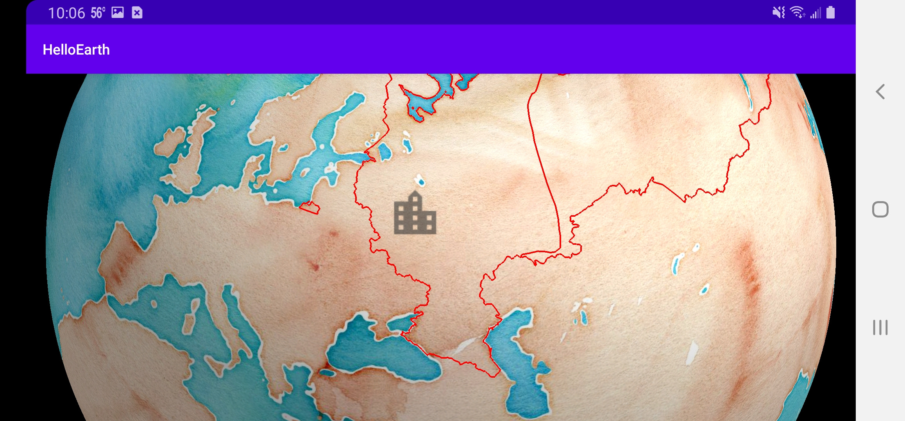
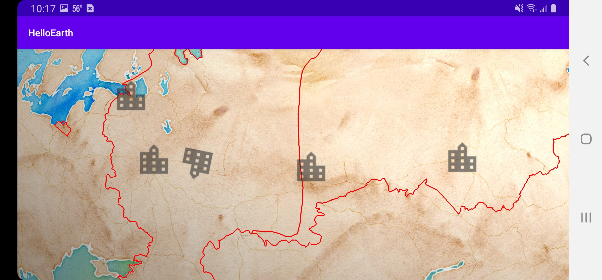

A basic feature found in almost every mapping toolkit is the marker. Screen markers are 2D markers that follow a location on the globe or map. They move as the map or globe moves, but they don’t get any larger or smaller.

In our last tutorial, we added the border of Russia as a GeoJSON feature on the map. Now we are going to add the [five most populous cities in Russia](https://en.wikipedia.org/wiki/List_of_cities_and_towns_in_Russia_by_population).

### Import Icon as Image Asset

<figure style="float:right;"><a href="https://s3.amazonaws.com/whirlyglobedocs/tutorialsupport/ic_city.png" download></a><figcaption style="text-align:center"><a href="https://s3.amazonaws.com/whirlyglobedocs/tutorialsupport/ic_city.png" download>Download Icon</a></figcaption></figure>WhirlyGlobe-Maply uses [`Bitmap`](https://developer.android.com/reference/android/graphics/Bitmap.html) objects to draw markers on the map. The easiest way to create a `Bitmap` in your app is to add a PNG to your app's resources. It turns out that Google's [Material Design Icon](https://design.google.com/icons/#ic_location_city) library has many great icons that can be used for a screen marker. Usually these icons come in SVG and PNG formats, including several different resolutions. Depending on how large you want your icon to be, choose whatever PNG size makes sense. For our tutorial, we chose an `drawable-xxhdpi` icon called `ic_location_city_black_48dp.png`. This image is 144x144px. The actual pixel dimensions are how we specify icon size in the toolkit, so these are what you want to look at when considering your icon resolution.

To get a PNG into your application's assets as an `R.drawable`, you need to right click on your project and add a new __Image Asset__.


The options to select are a bit counter-intuitive. Select in the top dropdown __Action Bar and Tab Icons__. The asset type needs to be __Image__. From there, you can select the path to the image you want to import.  You can accept the defaults on the next screen.


### First Screen Marker

Create a new [HelloMarkerFragment.java](https://github.com/mousebird/AndroidTutorialProject/blob/master/app/src/main/java/com/mousebirdconsulting/helloearth/HelloMarkerFragment.java), we are going to insert our markers right after we add our GeoJSON to the map. Create a new method called `insertMarkers`.

```java
package com.mousebirdconsulting.helloearth;

import android.graphics.Bitmap;
import android.graphics.BitmapFactory;

import com.mousebird.maply.BaseController;
import com.mousebird.maply.MarkerInfo;
import com.mousebird.maply.Point2d;
import com.mousebird.maply.ScreenMarker;

public class HelloMarkerFragment extends HelloGeoJsonFragment {

    @Override
    protected void controlHasStarted() {
        super.controlHasStarted();

        // Insert Markers
        insertMarkers();
    }

    private void insertMarkers() {
        MarkerInfo markerInfo = new MarkerInfo();
        Bitmap icon = BitmapFactory.decodeResource(getActivity().getResources(), R.drawable.ic_city);
        Point2d markerSize = new Point2d(144, 144);

        // Moscow - Москва
        ScreenMarker moscow = new ScreenMarker();
        moscow.loc = Point2d.FromDegrees(37.616667, 55.75); // Longitude, Latitude
        moscow.image = icon;
        moscow.size = markerSize;

        globeControl.addScreenMarker(moscow, markerInfo, BaseController.ThreadMode.ThreadAny);
    }
}
```

`MarkerInfo` is an options object used to configure special options for a marker, such as clustering and zoom restrictions. You specify the marker size with a `Point2d` object, then this dictates the dimensions of the icon in screen space. In our example, we gave it the same width and height of the image supplied, but you can change these parameters as you see fit, and the toolkit will scale the icon accordingly.

The basic properties of the object are set by assigning values to public members of the `ScreenMarker` object. Here we are setting the location, image, and marker size.

Finally, you can add an individual marker to your map controller with the `addScreenMarker` method.

Once again, reference the new fragment:

```xml
<?xml version="1.0" encoding="utf-8"?>
<androidx.constraintlayout.widget.ConstraintLayout xmlns:android="http://schemas.android.com/apk/res/android"
    xmlns:app="http://schemas.android.com/apk/res-auto"
    xmlns:tools="http://schemas.android.com/tools"
    android:id="@+id/relativeLayout"
    android:layout_width="match_parent"
    android:layout_height="match_parent"
    tools:context=".MainActivity">

    <fragment
        android:id="@+id/fragment"
        android:name="com.mousebirdconsulting.helloearth.HelloMarkerFragment"
        android:layout_width="match_parent"
        android:layout_height="match_parent"
        app:layout_constraintBottom_toTopOf="parent"
        app:layout_constraintEnd_toStartOf="parent"
        app:layout_constraintStart_toStartOf="parent"
        app:layout_constraintTop_toTopOf="parent" />

</androidx.constraintlayout.widget.ConstraintLayout>
```



### Add More Markers

To make a tutorial a little bit more interesting, we are going to add some more markers. Below you can see the code that adds to the map the five most populous cities in Russia.

```java
private void insertMarkers() {
    List<ScreenMarker> markers = new ArrayList<>();
    MarkerInfo markerInfo = new MarkerInfo();
    Bitmap icon = BitmapFactory.decodeResource(getActivity().getResources(), R.drawable.ic_city);
    Point2d markerSize = new Point2d(144, 144);

    // Moscow - Москва
    ScreenMarker marker = new ScreenMarker();
    marker.loc = Point2d.FromDegrees(37.616667, 55.75); // Longitude, Latitude
    marker.image = icon;
    marker.size = markerSize;
    markers.add(marker);

    //  Saint Petersburg - Санкт-Петербург
    marker = new ScreenMarker();
    marker.loc = Point2d.FromDegrees(30.3, 59.95);
    marker.image = icon;
    marker.size = markerSize;
    markers.add(marker);

    // Novosibirsk - Новосибирск
    marker = new ScreenMarker();
    marker.loc = Point2d.FromDegrees(82.95, 55.05);
    marker.image = icon;
    marker.size = markerSize;
    markers.add(marker);

    // Yekaterinburg - Екатеринбург
    marker = new ScreenMarker();
    marker.loc = Point2d.FromDegrees(60.583333, 56.833333);
    marker.image = icon;
    marker.size = markerSize;
    markers.add(marker);

    // Nizhny Novgorod - Нижний Новгород
    marker = new ScreenMarker();
    marker.loc = Point2d.FromDegrees(44.0075, 56.326944);
    marker.image = icon;
    marker.size = markerSize;
    marker.rotation = Math.PI;
    markers.add(marker);

    // Add your markers to the map controller.
    ComponentObject co = globeControl.addScreenMarkers(markers, markerInfo, BaseController.ThreadMode.ThreadAny);
}
```

Here we are adding all of our markers to an `ArrayList`. Then, we add this list to the map with `addScreenMarkers` instead of `addScreenMarker`.



You might notice that the icon for Нижний Новгород is upside down. This is because we adjusted the `rotation` property of `ScreenMarker nizhnyNovgorod`. The parameter is in radians, so π is equivalent to 180 degrees.

Lastly, `addScreenMarkers` returns a `ComponentObject` that you can keep track of. This object is your handle to the marker, vector, or other *component* object that you have added to your map controller. You can then later remove, enable, or disable the corresponding object.

```java
mapControl.removeObject(co, BaseController.ThreadMode.ThreadAny);
```

The [completed code](https://github.com/mousebird/AndroidTutorialProject/blob/master/app/src/main/java/com/mousebirdconsulting/helloearth/HelloMarkerFragment.java) for this tutorial is on Github for your reference.

---

*Tutorial by Nicholas Hallahan, Steve Gifford, Tim Sylvester.*

