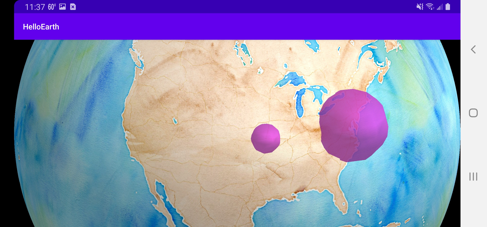

*Tutorial by Nicholas Hallahan.*

One interesting feature of the globe is that you can add 3D extrusions. In particular, we will show you how to add a sphere to your globe.

### Enable Hello Globe Fragment

This feature is availible only in the globe controller, not the map. Go into [activity_main.xml](https://github.com/mousebird/AndroidTutorialProject/blob/114123ea3ce55c65de7160429e453198ea958592/app/src/main/res/layout/activity_main.xml) and re-activate your `HelloGlobeFragment`. Your activity XML should look like this:

```xml
<?xml version="1.0" encoding="utf-8"?>
<RelativeLayout xmlns:android="http://schemas.android.com/apk/res/android"
    xmlns:tools="http://schemas.android.com/tools"
    android:layout_width="match_parent"
    android:layout_height="match_parent"
    tools:context="io.theoutpost.helloearth.MainActivity">

    <fragment
        android:layout_width="fill_parent"
        android:layout_height="fill_parent"
        android:name="io.theoutpost.helloearth.HelloGlobeFragment"
        android:id="@+id/fragment"
        android:layout_centerVertical="true"
        android:layout_centerHorizontal="true" />

    <!--<fragment-->
        <!--android:layout_width="fill_parent"-->
        <!--android:layout_height="fill_parent"-->
        <!--android:name="io.theoutpost.helloearth.HelloMapFragment"-->
        <!--android:id="@+id/fragment"-->
        <!--android:layout_centerVertical="true"-->
        <!--android:layout_centerHorizontal="true" />-->
</RelativeLayout>
```

### Insert Spheres

Add a `private void insertSpheres()` method and call it at the end of `controlHasStarted` in your [HelloGlobeFragment.java](https://github.com/mousebird/AndroidTutorialProject/blob/114123ea3ce55c65de7160429e453198ea958592/app/src/main/java/io/theoutpost/helloearth/HelloGlobeFragment.java).

```java
@Override
protected void controlHasStarted() {
    ...
    insertSpheres();
}

private void insertSpheres() {

}
```

Inside of `insertSpheres`, we are going to add four spheres, each with a different location and size.

```java
private void insertSpheres() {
    List<Shape> shapes = new ArrayList<>();

    // Kansas City
    ShapeSphere shape = new ShapeSphere();
    shape.setLoc(Point2d.FromDegrees(-94.58, 39.1));
    shape.setRadius(0.04f); // 1.0 is the radius of the Earth
    shapes.add(shape);

    // Washington D.C.
    shape = new ShapeSphere();
    shape.setLoc(Point2d.FromDegrees(-77.036667, 38.895111));
    shape.setRadius(0.1f);
    shapes.add(shape);

    // McMurdo Station
    shape = new ShapeSphere();
    shape.setLoc(Point2d.FromDegrees(166.666667, -77.85));
    shape.setRadius(0.2f);
    shapes.add(shape);

    // Windhoek
    shape = new ShapeSphere();
    shape.setLoc(Point2d.FromDegrees(17.083611, -22.57));
    shape.setRadius(0.08f);
    shapes.add(shape);

    ShapeInfo shapeInfo = new ShapeInfo();
    shapeInfo.setColor(0.7f, 0.2f, 0.7f, 0.8f); // R,G,B,A - values [0.0 => 1.0]
    shapeInfo.setDrawPriority(1000000);

    ComponentObject componentObject = globeControl.addShapes(shapes, shapeInfo, MaplyBaseController.ThreadMode.ThreadAny);
}
```

Here you will see that these spheres are placed on the globe and extrude above the surface of the globe.



### A few things to make note of...

The radius is a floating point value between `0.0f` and `1.0f`. `1.0f` is the radius of the Earth.

The location of the sphere is determined by `setLoc`, and this takes a `Point2d` object. You can easily convert a WGS84 (longitude, latitude) coordinate with the convenice function `Point2d.FromDegrees`.

The styling of the the shape is done with the `ShapeInfo` object. This works similarly to `MarkerInfo` and `LabelInfo`. The color is set by 4 floating point values [0.0 => 1.0]. These are your RGBA values.

Like always, when you add a `ShapeSphere` to your controller, you are given a `ComponentObject` from which you can enable, disable, and remove your sphere from the globe.

