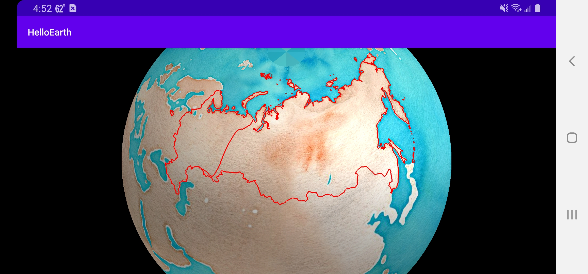

This tutorial guides you through adding GeoJSON vector data to your globe.

### Create AsyncTask

Picking up from the previous tutorial, create a new Java file in your `helloearth` package. Name it `GeoJsonHttpTask.java`. You can reference the completed [GeoJsonHttpTask.java](https://github.com/mousebird/AndroidTutorialProject/blob/master/app/src/main/com/mousebirdconsulting/helloearth/GeoJsonHttpTask.java) on Github.

This Java class will extend `AsyncTask`, representing an HTTP request for GeoJSON in the background which adds the result to the given controller. Doing a long-lasting task in as an AsyncTask keeps your main UI thread from locking up. Paste the following boilerplate code in your `GeoJsonHttpTask.java` file.

```java
package io.theoutpost.helloearth;

import android.os.AsyncTask;
import com.mousebird.maply.MaplyBaseController;

public class GeoJsonHttpTask extends AsyncTask<String, Void, String> {

    MaplyBaseController controller;

    public GeoJsonHttpTask(MaplyBaseController maplyBaseController) {
        controller = maplyBaseController;
    }

    @Override
    protected String doInBackground(String... params) {
        return null;
    }

    @Override
    protected void onPostExecute(String string) {

    }
}
```

### Fetch GeoJSON String

The `doInBackground` method is where work is done in a background thread. Here we will make our HTTP request and build the response buffer into a string. The following code will return a GeoJSON string back to the UI thread for further action.

```java
@Override
protected String doInBackground(String... params) {
    HttpURLConnection urlConnection;
    try {
        String urlStr = params[0];
        URL url = new URL(urlStr);
        urlConnection = (HttpURLConnection) url.openConnection();
        urlConnection.setConnectTimeout(3000);
        urlConnection.setReadTimeout(7000);
        int statusCode = urlConnection.getResponseCode();

        // 200 represents HTTP OK
        if (statusCode == 200) {
            BufferedReader r = new BufferedReader(new InputStreamReader(urlConnection.getInputStream()));
            StringBuilder response = new StringBuilder();
            String line;
            while ((line = r.readLine()) != null) {
                response.append(line);
            }
            return response.toString();
        }
    } catch (Exception e) {
        // didn't work
    }
    return null;
}
```

If the request fails and we do not get a string of GeoJSON, we return `null`. 

### Create Vector Object and Add to Map

Once we have created our GeoJSON string, we can add it to the map in `onPostExectue`.

```java
@Override
protected void onPostExecute(String json) {
    VectorObject object = new VectorObject();
    if (object.fromGeoJSON(json)) {
        VectorInfo vectorInfo = new VectorInfo();
        vectorInfo.setColor(Color.RED);
        vectorInfo.setLineWidth(4.f);
        controller.addVector(object, vectorInfo, BaseController.ThreadMode.ThreadAny);
    }
}
```

Here we create a vector object out of the GeoJSON.  If successful, we add it to the target controller to be drawn on each frame where it's visible.

Notice that when you add the vector to the map controller, the 3rd argument is `ThreadMode.ThreadAny`. This indicates that the underlying tesselation and geometry processing work is to be done in a worker thread in the WhirlyGlobe library. You can use `ThreadMode.ThreadCurrent` if you want to control the thread on which this work is done.

### Instantiate GeoJsonHttpTask

Again create a new fragment, `HelloGeoJsonFragment` or use [HelloGeoJsonFragment.java](https://github.com/mousebird/AndroidTutorialProject/blob/master/app/src/main/java/com/mousebirdconsulting/helloearth/HelloGeoJsonFragment.java).  Here we build on `HelloGlobeFragment` and add our GeoJSON request.

```java
package com.mousebirdconsulting.helloearth;

import android.os.AsyncTask;

public class HelloGeoJsonFragment extends HelloGlobeFragment {

    @Override
    protected void controlHasStarted() {
        super.controlHasStarted();

        double latitude = 60 * Math.PI / 180;
        double longitude = 90 * Math.PI / 180;
        double zoom_earth_radius = 2.0;
        globeControl.animatePositionGeo(longitude, latitude, zoom_earth_radius, 1.0);

        final String url = "https://s3.amazonaws.com/whirlyglobedocs/tutorialsupport/RUS.geojson";

        if (loadTask != null) {
            loadTask.cancel(true);
            loadTask = null;
        }
        loadTask = new GeoJsonHttpTask(globeControl);

        loadTask.executeOnExecutor(AsyncTask.THREAD_POOL_EXECUTOR, url);
    }

    @Override
    public void onDestroy() {
        if (loadTask != null) {
            loadTask.cancel(true);
            loadTask = null;
        }
        super.onDestroy();
    }

    private GeoJsonHttpTask loadTask = null;
}
```

You now should see the red outline of Russia on the map from GeoJSON fetched via HTTP.



---

*Tutorial by Nicholas Hallahan, Steve Gifford, Tim Sylvester.*

