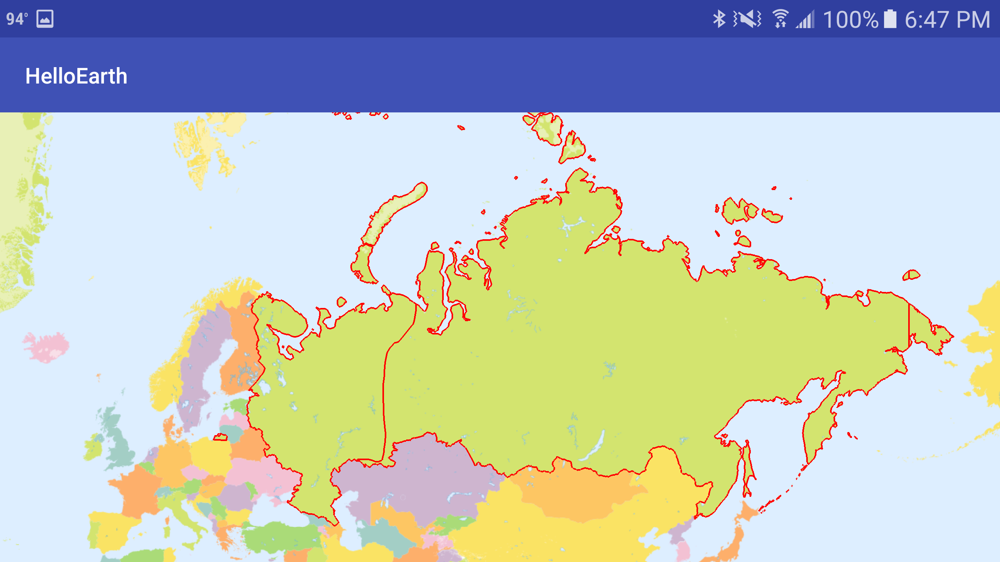

*Tutorial by Nicholas Hallahan.*

This tutorial guides you through adding GeoJSON vector data to your map. Picking up from the previous tutorial, create a new Java file in your `helloearth` package. Name it `GeoJsonHttpTask.java`. You can reference the completed [GeoJsonHttpTask.java](https://github.com/mousebird/AndroidTutorialProject/blob/master/app/src/main/java/io/theoutpost/helloearth/GeoJsonHttpTask.java) on Github.

### Create AsyncTask

This Java class will extend `AsyncTask` , allowing you to do an HTTP request in the background. Doing a long-lasting task in as an AsyncTask keeps your main UI thread from locking up. Paste the following boilerplate code in your `GeoJsonHttpTask.java` file.

```java
package io.theoutpost.helloearth;

import android.os.AsyncTask;
import com.mousebird.maply.MaplyBaseController;

public class GeoJsonHttpTask extends AsyncTask<String, Void, String> {

    MaplyBaseController controller;

    public GeoJsonHttpTask(MaplyBaseController maplyBaseController) {
        controller = maplyBaseController;
    }

    @Override
    protected String doInBackground(String... params) {
        return null;
    }

    @Override
    protected void onPostExecute(String string) {

    }
}
```

### Instantiate GeoJsonHttpTask

In `HelloMapFragment.java`, place the [following code](https://github.com/mousebird/AndroidTutorialProject/blob/edf4f6f3414c79f5c4e43a3f0c79e0d64c41a866/app/src/main/java/io/theoutpost/helloearth/HelloMapFragment.java#L102-L104) at the end of the `controlHasStarted` method. 

```java
final String url = "https://s3.amazonaws.com/whirlyglobedocs/tutorialsupport/RUS.geojson";
GeoJsonHttpTask task = new GeoJsonHttpTask(mapControl);
task.executeOnExecutor(AsyncTask.THREAD_POOL_EXECUTOR, url);
```

This will instantiate your GeoJsonHttpTask AsyncTask and give it a reference to the map controller. Then, we execute the task from a background thread pool and give it a URL to the GeoJSON you want on the map.

### Fetch GeoJSON String

The `doInBackground` method is where work is done in a background thread. Here we will make our HTTP request and build the response buffer into a string. The following code will return a GeoJSON string back to the UI thread for further action.

```java
@Override
protected String doInBackground(String... params) {
    HttpURLConnection urlConnection;
    try {
        String urlStr = params[0];
        URL url = new URL(urlStr);
        urlConnection = (HttpURLConnection) url.openConnection();
        urlConnection.setConnectTimeout(3000);
        urlConnection.setReadTimeout(7000);
        int statusCode = urlConnection.getResponseCode();

        // 200 represents HTTP OK
        if (statusCode == 200) {
            BufferedReader r = new BufferedReader(new InputStreamReader(urlConnection.getInputStream()));
            StringBuilder response = new StringBuilder();
            String line;
            while ((line = r.readLine()) != null) {
                response.append(line);
            }
            return response.toString();
        }
    } catch (Exception e) {
        // didn't work
    }
    return null;
}
```

If the request fails and we do not get a string of GeoJSON, we return `null`. 

### Create Vector Object and Add to Map

Once we have created our GeoJSON string, we can add it to the map in `onPostExectue`.

```java
@Override
protected void onPostExecute(String json) {
    VectorInfo vectorInfo = new VectorInfo();
    vectorInfo.setColor(Color.RED);
    vectorInfo.setLineWidth(4.f);
    VectorObject object = new VectorObject();
    if (object.fromGeoJSON(json)) {
        controller.addVector(object, vectorInfo, MaplyBaseController.ThreadMode.ThreadAny);
    }
}
```

The `if` statement checks if we were able to create a vector object from the JSON string. If it is null or invalid GeoJSON, `fromGeoJSON` returns false. Also notice that when you add the vector to the map controller, the 3rd argument is `MaplyBaseController.ThreadMode.ThreadAny`. This `enum` states that the underlying tesselation and geometry processing work is done in a worker thread in the WhirlyGlobe library. You can alternatively use `MaplyBaseController.ThreadMode.ThreadCurrent` if you want to have control over what thread this underlying work is executed on.

That's it! You now should see the red outline of Russia on the map from GeoJSON fetched via HTTP.


