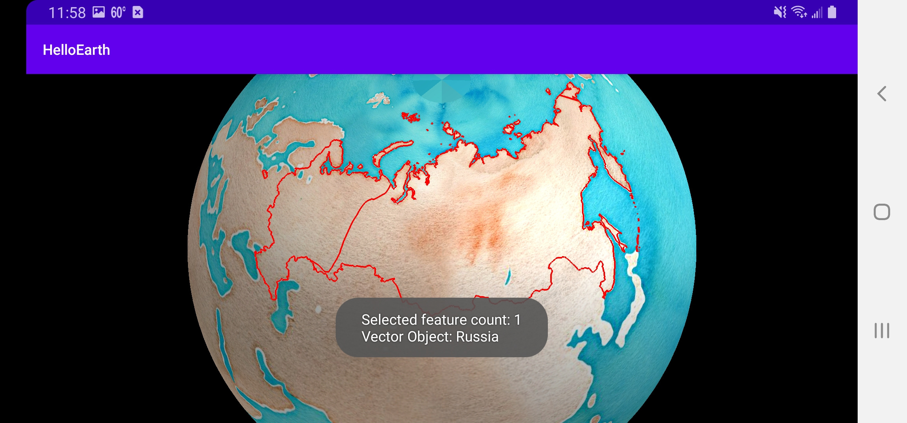
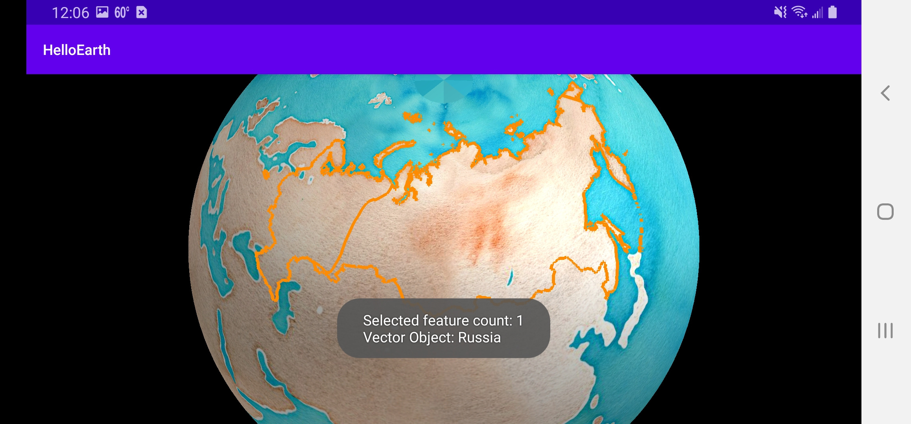

*Tutorial by Nicholas Hallahan.*

Sometimes it is important to be able to select the actual vector data on your map. On a [previous tutorial](vector-data.html), we added vector data to the map from GeoJSON. Though the user can see the country of Russia on the map, we might also need to be able to touch the polygon to pull up information about that geographic feature.

### Make Vector Object Selectable

Vector selection in WhirlyGlobe--Maply is easy to enable. First, make sure that you have set your `VectorObject` to be selectable. In [GeoJsonHttpTask.java](https://github.com/mousebird/AndroidTutorialProject/blob/3318085f5192b6cf28a7294968a480006817804a/app/src/main/java/io/theoutpost/helloearth/GeoJsonHttpTask.java#L55), set `object.selectable = true;`.

```java
@Override
protected void onPostExecute(String json) {
    VectorInfo vectorInfo = new VectorInfo();
    vectorInfo.setColor(Color.RED);
    vectorInfo.setLineWidth(4.f);
    VectorObject object = new VectorObject();
    object.selectable = true;
    if (object.fromGeoJSON(json)) {
        controller.addVector(object, vectorInfo, MaplyBaseController.ThreadMode.ThreadAny);
    }
}
```

### Create Gesture Delegate Method

The super class of `HelloMapFragment` is `GlobeMapFragment`. One of the methods defined is `userDidSelect`. This is a delegate method that you can override that gets called whenever a map object is selected. In [HelloMapFragment.java](https://github.com/mousebird/AndroidTutorialProject/blob/3318085f5192b6cf28a7294968a480006817804a/app/src/main/java/io/theoutpost/helloearth/HelloMapFragment.java#L273-L274), create the following method:

```java
@Override
public void userDidSelect(MapController mapControl, SelectedObject[] selObjs, 
                          Point2d loc, Point2d screenLoc) {

}
```

This method will be called whenver a vector object is selected.

### Set Fragment as Gesture Delegate

Your map controller needs to know that your `HelloMapFragment` should be notified as the gesture delegate whenever a selection occurs. In the [`controlHasStarted`](https://github.com/mousebird/AndroidTutorialProject/blob/3318085f5192b6cf28a7294968a480006817804a/app/src/main/java/io/theoutpost/helloearth/HelloMapFragment.java#L122) method, set:

```java
@Override
protected void controlHasStarted() {
    ...
    // Set controller to be gesture delegate.
    // Needed to allow selection.
    mapControl.gestureDelegate = this;
    ...
}
```

It doesn't matter when you set this fragment as the delegate, as long as it happens before the user actually selects the vector. `controlHasStarted` is the most logical place for us to do this.

### Notify User of Selection

There are a lot of things you can do when `userDidSelect` is fired. To keep things simple, the following implementation will create a `Toast` message that displays the admin name of the polygon that was selected.

```java
@Override
public void userDidSelect(MapController mapControl, SelectedObject[] selObjs, Point2d loc, Point2d screenLoc) {
    String msg = "Selected feature count: " + selObjs.length;
    for (SelectedObject obj : selObjs) {
        // GeoJSON
        if (obj.selObj instanceof VectorObject) {
            VectorObject vectorObject = (VectorObject) obj.selObj;
            AttrDictionary attributes = vectorObject.getAttributes();
            String adminName = attributes.getString("ADMIN");
            msg += "\nVector Object: " + adminName;
        }
    }

    Toast.makeText(getActivity(), msg, Toast.LENGTH_LONG).show();
}
```



### Draw Vector as Selected

Now that we can programatically get a vector object that has been selected, we might want to redraw that vector on the map in a way that indicates that it has been selected. To do this, we take the selected vector object and re-add it to our map controller with a different color and higher draw priority.

Create the [following method](https://github.com/mousebird/AndroidTutorialProject/blob/edd635806ffe7f62039fb40f3fdef3c8c5d1becd/app/src/main/java/io/theoutpost/helloearth/HelloMapFragment.java#L299-L308) in `HelloMapFragment`:

```java
public void drawVectorObjectAsSelected(VectorObject vectorObject) {
    if (selectedComponentObject != null) {
        mapControl.removeObject(selectedComponentObject, MaplyBaseController.ThreadMode.ThreadAny);
    }
    VectorInfo vectorInfo = new VectorInfo();
    vectorInfo.setColor(Color.argb(255,255,140,0)); // Gold
    vectorInfo.setLineWidth(10.f);
    vectorInfo.setDrawPriority(Integer.MAX_VALUE); // Make sure it draws on top of unselected vector
    selectedComponentObject = mapControl.addVector(vectorObject, vectorInfo, MaplyBaseController.ThreadMode.ThreadAny);
}
```

This method is to be called in `userDidSelect` when we are [handling](https://github.com/mousebird/AndroidTutorialProject/blob/edd635806ffe7f62039fb40f3fdef3c8c5d1becd/app/src/main/java/io/theoutpost/helloearth/HelloMapFragment.java#L286) a selected `VectorObject`.

```java
// GeoJSON
if (obj.selObj instanceof VectorObject) {
    VectorObject vectorObject = (VectorObject) obj.selObj;
    AttrDictionary attributes = vectorObject.getAttributes();
    String adminName = attributes.getString("ADMIN");
    msg += "\nVector Object: " + adminName;
    drawVectorObjectAsSelected(vectorObject);
}
```

Lastly, make sure you have a class member `ComponentObject selectedComponentObject;`. Whenever a selection is made, we check to see if there was a previous selection and remove it from the map controller.

Now, when a user taps on Russia, it should have a golden border instead of red.


