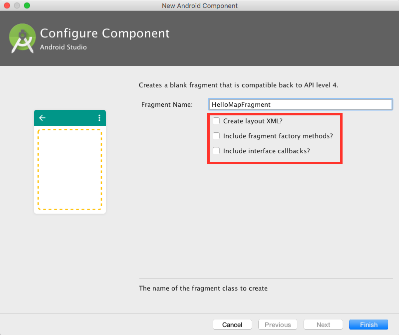

*Tutorial by Nicholas Hallahan.*

### Globe or Map

You can make a 3D globe or a 2D map equally well in WhirlyGlobe-Maply.  Hence the name.  Most of the objects are the same and, after a bit of setup, you use them almost identically.


If you want a rotating globe, you'll want a `MapDisplayType.Globe`. If you want a slippy map, you'll want a `MapDisplayType.Map` enum in your `GlobeMapFragment`. We'll go into greater detail about this setting later in the tutorial.

### Add Internet Permission

We'll need to be able to load tile images from the internet, which means the application will need to request the internet permission. Add the following `uses-permission` element to the manifest section of `app/manifests/AppManifest.xml`:

```xml
<?xml version="1.0" encoding="utf-8"?>
<manifest xmlns:android="http://schemas.android.com/apk/res/android"
    package="com.mousebirdconsulting.helloearth">

    <application
        android:allowBackup="true"
        android:icon="@mipmap/ic_launcher"
        android:label="@string/app_name"
        android:roundIcon="@mipmap/ic_launcher_round"
        android:supportsRtl="true"
        android:theme="@style/AppTheme">
        <activity android:name=".MainActivity">
            <intent-filter>
                <action android:name="android.intent.action.MAIN" />

                <category android:name="android.intent.category.LAUNCHER" />
            </intent-filter>
        </activity>
    </application>
    <uses-permission android:name="android.permission.INTERNET"/>
</manifest>
```

### Include Fragment in Activity XML

Open `app/res/layout/activity_main.xml` and select the "Code" view. Replace the `TextView` with the fragment element as shown below.

#### activity_main.xml

```xml
<?xml version="1.0" encoding="utf-8"?>
<androidx.constraintlayout.widget.ConstraintLayout xmlns:android="http://schemas.android.com/apk/res/android"
    xmlns:app="http://schemas.android.com/apk/res-auto"
    xmlns:tools="http://schemas.android.com/tools"
    android:id="@+id/relativeLayout"
    android:layout_width="match_parent"
    android:layout_height="match_parent"
    android:background="#FF0000"
    tools:context=".MainActivity">

    <fragment
        android:id="@+id/fragment"
        android:name="com.mousebird.maply.GlobeMapFragment"
        android:layout_width="match_parent"
        android:layout_height="match_parent"
         />

</androidx.constraintlayout.widget.ConstraintLayout>
```

That's it! You can now build your app. A globe with a Stamen Watercolor base layer should appear.


### Create a Map Fragment

It is a similar process creating a map instead of a globe. Go ahead and create another blank fragment as you have done before. Name this one `HelloMapFragment`.



Select __Finish__.

### Replace Activity XML with Map Fragment

In your `activity_main.xml`, comment out the `HelloGlobeFragment` and replace it with your new `HelloMapFragment`.

```xml
<?xml version="1.0" encoding="utf-8"?>
<RelativeLayout xmlns:android="http://schemas.android.com/apk/res/android"
    xmlns:tools="http://schemas.android.com/tools"
    android:layout_width="match_parent"
    android:layout_height="match_parent"
    tools:context="io.theoutpost.helloearth.MainActivity">

    <!--<fragment-->
        <!--android:layout_width="fill_parent"-->
        <!--android:layout_height="fill_parent"-->
        <!--android:name="io.theoutpost.helloearth.HelloGlobeFragment"-->
        <!--android:id="@+id/fragment"-->
        <!--android:layout_centerVertical="true"-->
        <!--android:layout_centerHorizontal="true" />-->

    <fragment
        android:layout_width="fill_parent"
        android:layout_height="fill_parent"
        android:name="io.theoutpost.helloearth.HelloMapFragment"
        android:id="@+id/fragment"
        android:layout_centerVertical="true"
        android:layout_centerHorizontal="true" />
</RelativeLayout>
```

### Setup HelloMapFragment.java

Open your `HelloMapFragment.java` file and delete the boilerplate code. Replace it with the following:

```java
package io.theoutpost.helloearth;

import android.os.Bundle;
import android.view.LayoutInflater;
import android.view.View;
import android.view.ViewGroup;
import com.mousebird.maply.GlobeMapFragment;
import com.mousebird.maply.QuadImageTileLayer;
import com.mousebird.maply.RemoteTileInfo;
import com.mousebird.maply.RemoteTileSource;
import com.mousebird.maply.SphericalMercatorCoordSystem;

import java.io.File;


public class HelloMapFragment extends GlobeMapFragment {

    @Override
    public View onCreateView(LayoutInflater inflater, ViewGroup container,
                             Bundle inState) {
        super.onCreateView(inflater, container, inState);

        // Do app specific setup logic.

        return baseControl.getContentView();
    }

    @Override
    protected MapDisplayType chooseDisplayType() {
        return MapDisplayType.Map;
    }

    @Override
    protected void controlHasStarted() {
        // setup base layer tiles
        String cacheDirName = "stamen_watercolor";
        File cacheDir = new File(getActivity().getCacheDir(), cacheDirName);
        cacheDir.mkdir();
        RemoteTileSource remoteTileSource = new RemoteTileSource(new RemoteTileInfo("http://tile.stamen.com/watercolor/", "png", 0, 18));
        remoteTileSource.setCacheDir(cacheDir);
        SphericalMercatorCoordSystem coordSystem = new SphericalMercatorCoordSystem();

        // globeControl is the controller when using MapDisplayType.Globe
        // mapControl is the controller when using MapDisplayType.Map
        QuadImageTileLayer baseLayer = new QuadImageTileLayer(mapControl, coordSystem, remoteTileSource);
        baseLayer.setImageDepth(1);
        baseLayer.setSingleLevelLoading(false);
        baseLayer.setUseTargetZoomLevel(false);
        baseLayer.setCoverPoles(true);
        baseLayer.setHandleEdges(true);

        // add layer and position
        mapControl.addLayer(baseLayer);
        mapControl.animatePositionGeo(-3.6704803, 40.5023056, 5, 1.0);
        mapControl.setAllowRotateGesture(true);
    }

}
```

You can download [HelloMapFragment.java](resources/HelloMapFragment.java) and place it directly in your project. 

Notice that this fragment is almost exactly the same as `HelloGlobeFragment.java`. There are three differences:

1. `chooseDisplayType` returns `MapDisplayType.Map` instead of `MapDisplayType.Globe`.
2. `controlHasStarted` uses `mapControl` instead of `globeControl`.
3. We allow the rotation gesture on `mapControl` with `setAllowRotateGesture`.

With these changes, your app will now have a map instead of a globe. Go ahead and build and run. A map with a Stamen Watercolor base layer should appear.


